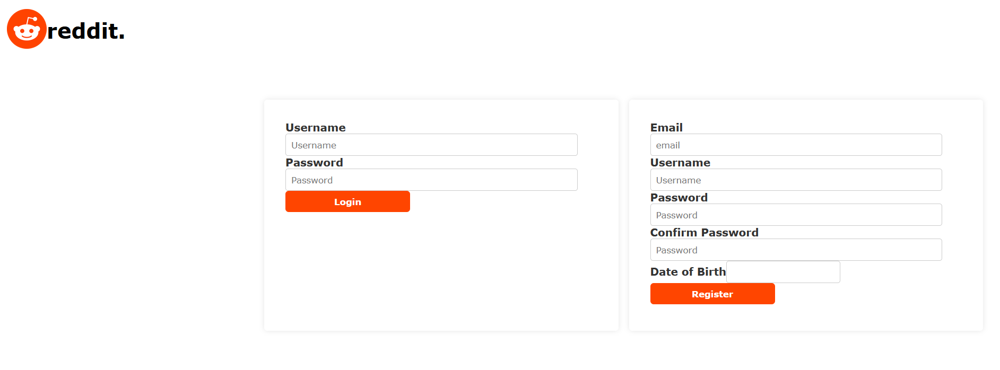
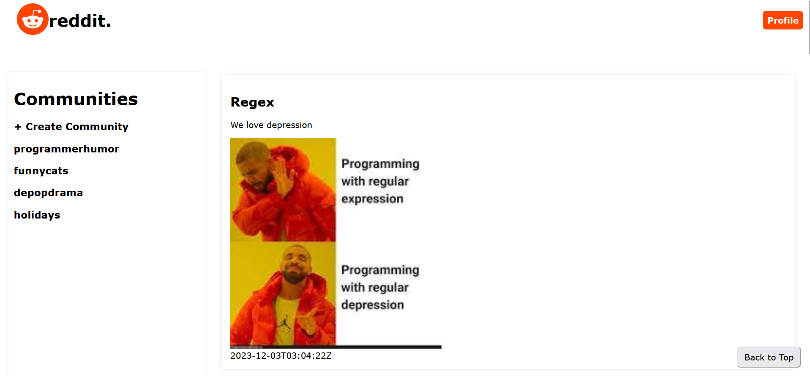
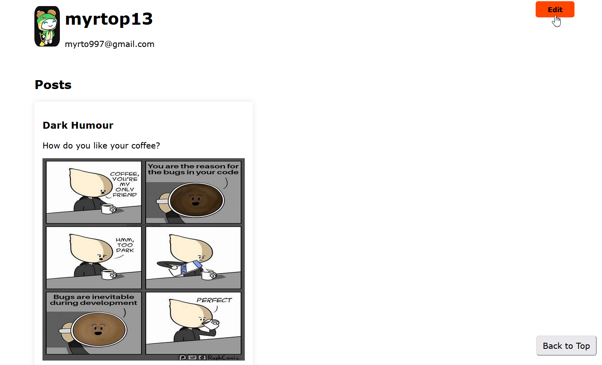
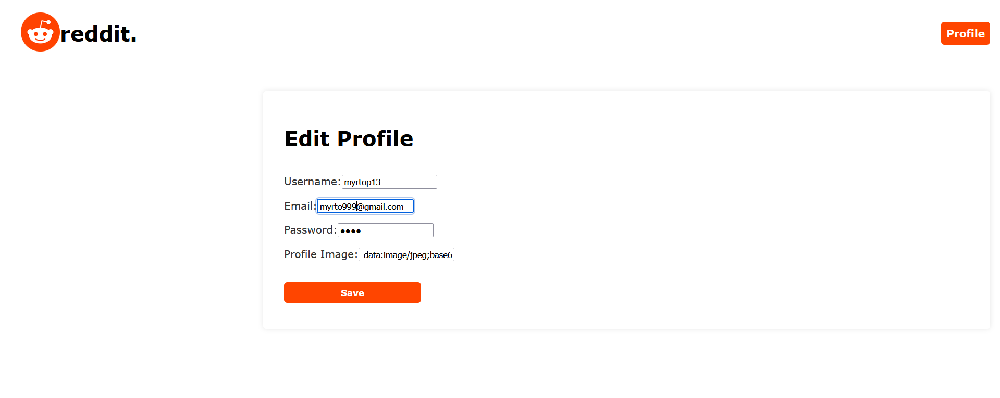
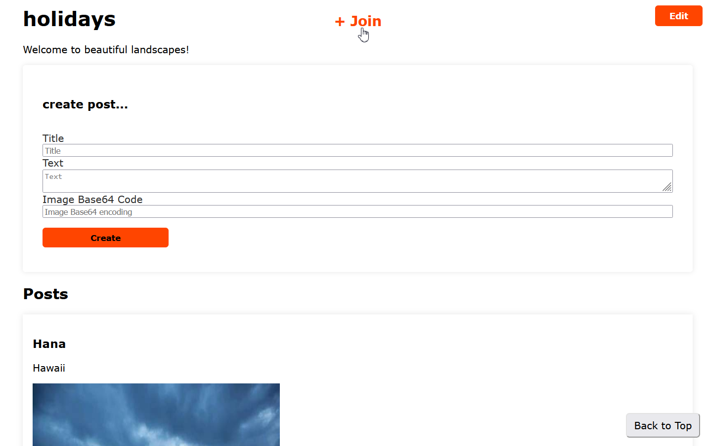

# Reddit-like App

## Overview
This project is a web application that provides a REST API for managing users, posts, and comments. The backend is developed using Java with the Spring Boot framework, while the frontend is built with React.
The objectives of this web application are:
- Handling resources. To manage the available data of the resources provided the crude operations put, delete and post can be executed for each. It is worth noting that log in and sign up actions for the user are supported.
- Visualise data. In order to view the contents of each resource the crude operation get is executed, to fetch data on the frontend part of the app.

## Technologies
The project uses the following technologies:

- **Backend**:
    - Java - v17
    - Spring Boot - v3.0.6
    - Maven (for dependency management)
    - PostgreSQL - v15

- **Frontend**:
    - React - v6
    - Node.js - v18
    - html
    - css

## Prerequisites
Before running the application, ensure that you have the following software installed:
- npm
- Node.js: It can be installed via terminal via the command: `npm install node.js`
- postgreSQL

## Usage
To run the application, follow these steps:
- Open a new terminal.
- Navigate to: `cd restapi`
- Run the command: `mvn spring-boot:run`

1. Start the backend server:
   Run ReastApiApplication

2. Start the frontend development server:
    - Open a new terminal.
    - Navigate to: `cd react-reddit-app`
    - Run the command: `npm start`

3. Access the application in your web browser at: `http://localhost:3000`

## API Documentation Example
The API provides endpoints for all resources like the following. This example showcases endpoints for users:

- `GET /users`: Retrieve a list of users.
- `GET /users/{userId}`: Retrieve details of a specific user.
- `POST /users`: Create a new user.
- `PUT /users/{userId}`: Update a user.
- `DELETE /users/{userId}`: Delete a user.

## Screenshots
\
Log in or Sign up Page with authentication

\
Main Page: Showcases posts, available communities and create community action.

\
User profile page.

\
Edit profile page action.

\
Community page: Features community posts, description, create post action and join community button.

